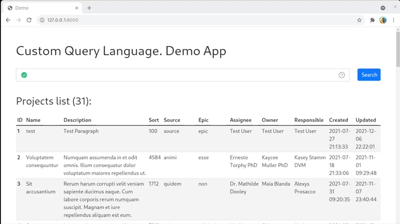
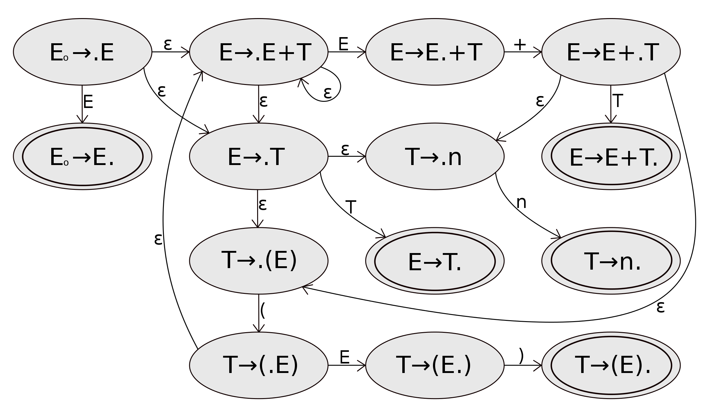
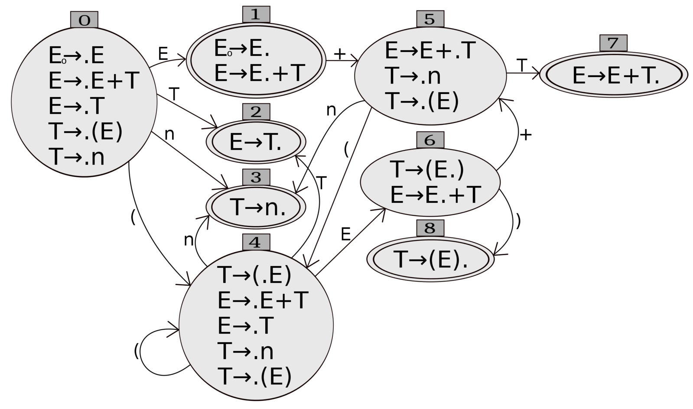

# What is it?

It's a Custom Query Language demo application written on top of the Symfony framework. 
You write a query, and you get the needed results from a database.

[](https://youtu.be/XmGpKVYzc2w)

The custom query language allows to define any grammar rules and be
sure the user entered a correct query. It’s a simplification of the SQL and
in the same time it adds new unique functionality by your needs.

##   How does it work?
For example, you want to see a list of projects from the "projects" table in
a database. And you want to see projects with the ”example” name. You type “name = example” in the query input.

### Lexer
Lexer receives the raw query and split it into the tokens array:
1. StringToken, value - name
2. EqualToken
3. StringToken, value - example

### Parser
Parser receives the tokens array and build the abstract syntax tree (AST):
* QueryNode
  * ConditionalExpressionNode
    * AlphanumericComparisonExpressionNode
      * FieldNode
        - StringToken, value - name
      * ComparisonOperatorNode
        - EqualToken
      * ComparisonValueNode
        - StringToken, value - example

The example is simplified. The real AST is slightly more complex.

### Transpiler
Transpiler receives the AST from the parser and build the final SQL query:
```sql
SELECT * FROM project WHERE name = 'example'
```

The results of the query are returned to the user.

## What is under the hood?

A little more about the internals. 

### Lexer
The lexer reads the query string symbol by symbol and decide what to do next. If it's a letter than it's probably a string token, so it continues reading
until the letters end. Later on it combines the letters sequence into a single
token object. If a string is equal to a keyword than a keyword token will be created.

For example the "not" word is a string. So a StringToken can be created. But at
the same time it's a dedicated keyword with its own meaning in the grammar. So 
the lexer will create a NotToken instead of a simple string.

If the lexer sees the "=" symbol than it is possible to make an EqualToken
immediately without further reading. 

More about the lexers' internals:
- [https://craftinginterpreters.com/scanning.html](https://craftinginterpreters.com/scanning.html)
- [Source code](src/Lexer/Lexer.php)

### LR(0) Parser
There are two main parsing methods: [recursive descent](https://en.wikipedia.org/wiki/Recursive_descent_parser) and
[recursive ascent](https://en.wikipedia.org/wiki/Recursive_ascent_parser). They both can build an AST but have different
advantages and disadvantages. 

Recursive descent parser is simpler and can be written by hand, but it has difficulties 
with a grammar which includes left  recursion rules. For example, it cannot
work properly with the grammar like:
```conditional_expression := conditional_expression "OR" conditional_term```

Recursive ascent parsers are not written by hand usually. They use a pre-made
transitions table. And they know how to handle left recursion grammar rules.
That's why I've chosen the recursive ascent parser for the Custom Query 
Language implementation.

The parser use a transitions table during the parsing. Each row of
this table is a parsing state. Each column of the table is a **terminal** (a token from the lexer)
or a **non-terminal** (AlphanumericComparisonExpressionNode for example, can consist of other nodes and terminals). 
So the parser switches between states during the parsing and because of the transitions table knows what to expect
in the exact state.

Within the transitions table parser needs to process tokens list only once. It reads tokens
one by one with the O(n) complexity. 

There are multiple ways to build this table. For example the table can be built
by [Bison](https://en.wikipedia.org/wiki/GNU_Bison),
[Yacc](https://en.wikipedia.org/wiki/Yacc),
[ANTLR](https://en.wikipedia.org/wiki/ANTLR), and some other good parser compilers/generators.
This application has its own PHP implementation of a parser compiler. It allows
easy and quick grammar adjusting, clean syntax errors handling and useful query input
suggestions.

The parser compiler is a crucial part of this application, although it doesn't
participate in the query processing directly. It just generates a transitions table
and that's it. That's why I've made a separate block
about the parser compiler in this README later.

### Transpiler
To process the abstract syntax tree the transpiler uses a [visitor pattern](https://refactoring.guru/design-patterns/visitor).
The visitor visits each node of the AST and do some operations with a respect to 
the node type. 

### Suggestions Manager
It's good to have suggestions during the query input. The suggestions drastically 
reduce the number of input errors, so I've made a suggestions' manager. 

The [suggestions' manager](src/Transpiler/SuggestionManager.php) cut a query till the caret position and tries to parse
it with the parser. It always stops the parsing before the acceptance in an unfinished
state even if the query before the caret position is correct. 

Later on the suggestions' manager asks the parser about expected tokens and
build all possible suggestions from the received list. 

### Vue.js Frontend
To see all the above in action I've made a [Vue.js frontend application](assets/App.vue). 
The frontend is written in typescript.

There are two main tasks of the frontend:
1. Query validation
2. Projects list fetching

#### Query Validation
As only a user stops typing, if the pause is at least 350 milliseconds than 
the frontend sends a new AJAX request to the /validate symfony controller. The
request has a query itself and a caret position in the input. 

In return, it receives the query state object. The query state object has information
about the correctness of the query, an errors list and a list of suggestions.

#### Projects List Fetching
Once the user clicks on the "Search" button the frontend sends a new request to
the "/projects" symfony controller. In return, it receives the same query 
state object and a list of projects found by the user's query.

## Parser Compiler / Parser Generator
The parser compiler consists of three main parts - the compiler itself, the finite
state machine, and the resulting transitions table.

### What is the finite-state machine?
We have some grammar rules of our query language. For example, we definitely know that
a query cannot be started from a "=" symbol. So grammar rules just describe each
possible words combination. The grammar can be presented in different forms
and one of the most famous forms is Backus-Naur Form (BNF).

A simple grammar example with four grammar rules:
1. E := E + T
2. E := T
3. T := n
4. T := ( E )

Capital letters are non-terminals, so they can consist of other non-terminals 
and terminals.

Lowercase letters are terminals, so they represent themselves only.

Each grammar rule can have a state of reading. For example:
- **E := . E + T**, means we are expecting E non-terminal
- **E := E . + T**, means we consumed E non-terminal, and we are expecting "+" symbol
- **E := E + . T**, means we consumed "+" symbol, and we are expecting T non-terminal
- **E := E + T .**, means we consumed the whole input and can transform the right part to the left non-terminal

If we define an initial state as a new grammar rule **E0 := E**, then we can 
make a states graph:



The "ε" means no symbol. It means that we can be at multiple states simultaneously. 
If we combine those parallel states than we will have a new graph:



So depending on the consumed symbol we can move to a new following state. The 
first graph describes a non-deterministic finite-state machine. It is non-deterministic
because we can switch states without actual input. The second graph describes
a deterministic finite-state machine. It is deterministic because each following
state can be achieved by the exact consumed symbol.

### How it is used in the Custom Query Language application?
There is a [finite-state machine implementation](src/ParserCompiler/FiniteStateMachine.php) 
in the Custom Query Language application.
I build all possible states by a given rules set. You can check the actual grammar
rules set used by the application at the very bottom of this readme.

The states list from the finite-states machine is a first step on the way 
to build the transition table.

### What the parser compiler do?
It gets the states list from the finite-state machine and adds possible 
actions in the resulting transitions table. The transition table just returns
a possible action depending on the input, and it knows nothing about the action itself.

### What actions can be added into the transitions table?
There are four types of actions:
1. Shift, consume next token and move to a following state
2. Reduce, transform a right part of the grammar rule to a left part
3. Goto, change the state without consuming next symbol
4. Accept, the parsing is finished

The logic behind this adding is too complex to describe it here. You can check 
the [parser compiler source code](src/ParserCompiler/ParserCompiler.php) to learn more.

### How the transitions table looks like? Can you give an example?
Sure. For the simple grammar mentioned above the transitions table will look so:

| State |E|T|n|+|(|)|$|
|--- |--- |--- |--- |--- |--- |--- |--- |
|0|1|2|s(3)| |s(4)| | |
|1| | | |s(5)| | |r(0)|
|2| | | |r(2)| |r(2)|r(2)|
|3| | | |r(3)| |r(3)|r(3)|
|4|6|2|s(3)| |s(4)| | |
|5| |7|s(3)| |s(4)| | |
|6| | | |s(5)| |s(8)| |
|7| | | |r(1)| |r(1)|r(1)|
|8| | | |r(4)| |r(4)|r(4)|

Where 
- s(I) means a shift operation with a switch to I state.
- r(N) means a reduce operation. N is the grammar rule index
- r(0) means a reducing by the 0 grammar rule. Accept, finish parsing
- N cell means just a state switching without any additional actions
- $ symbol is the end of line

So in the initial state for the given grammar we expect just "n" or "(" symbols. 
All other terminals in the beginning of the query string will cause an error.

# Grammar of Custom Query Language

Backus-Naur form (BNF) notation

Non-Terminal | ::= | Elements
--- | --- | --- 
query | | conditional_expression (order_by_expression)?
order_by_expression | | "ORDER" "BY" field ("ASC" &vert; "DESC")
conditional_expression | | conditional_term &vert; conditional_expression OR conditional_term
conditional_term | | conditional_factor &vert; conditional_term AND conditional_factor
conditional_factor | | ( "!" &vert; "NOT" )? conditional_primary
conditional_primary | | simple_cond_expression &vert; "(" conditional_expression ")"
simple_cond_expression | | alphanumeric_comparison_expression &vert; date_comparison_expression &vert; in_expression &vert; contains_expression &vert; null_comparison_expression
alphanumeric_comparison_expression | | field comparison_operator alphanumeric_value
date_comparison_expression | | field comparison_operator date_value
in_expression | | field (not)? in "(" comma_separated_sequence ")"
contains_expression | | field contains_operator alphanumeric_value
null_comparison_expression | | field "IS" (NOT)? ("null" &vert; "empty") &vert; field ("=" &vert; "!=") ("null" &vert; "empty")
comparison_operator | | = &vert; != &vert; \> &vert; >= &vert; < &vert; <= &vert; 
contains_operator | | ~ &vert; !~
comma_separated_sequence | | alphanumeric_value &vert; comma_separated_sequence "," alphanumeric_value
alphanumeric_value | | NUMBER &vert; "-" NUMBER &vert; STRING
date_value | | dateModifierToken
field | | STRING